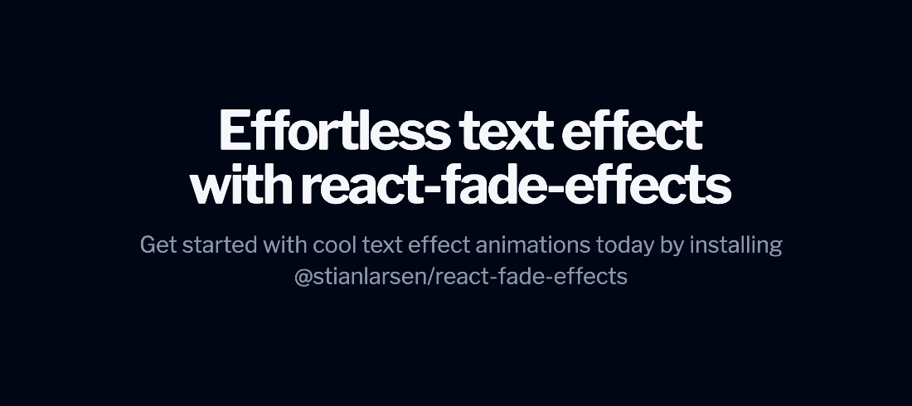

# @stianlarsen/react-fade-effects

[](https://www.npmjs.com/package/@stianlarsen/react-fade-effects)
[](https://www.npmjs.com/package/@stianlarsen/react-fade-effects)
[](https://bundlephobia.com/package/@stianlarsen/react-fade-effects)
[](https://github.com/stianlars1/react-fade-effects/blob/main/LICENSE)

Smooth fade-in text animations for React. Lightweight, customizable, and RSC-compatible.



## Installation

```bash
npm install @stianlarsen/react-fade-effects
```

## Quick Start

```tsx
import { FadeWords } from "@stianlarsen/react-fade-effects";

function App() {
  return <FadeWords words="Hello World" variant="up" />;
}
```

## Props

| Prop | Type | Default | Description |
|------|------|---------|-------------|
| `words` | `string \| string[]` | — | Text to animate |
| `variant` | `"default" \| "up" \| "down" \| "left" \| "right"` | `"default"` | Animation direction |
| `duration` | `number` | `1` | Animation duration (seconds) |
| `delay` | `number` | `0.2` | Initial delay (seconds) |
| `staggerTime` | `number` | `0.1` | Delay between words (seconds) |
| `filter` | `boolean` | `true` | Enable blur effect |
| `once` | `boolean` | `true` | Animate only once when in view |
| `scaleSize` | `number` | — | Initial scale factor |
| `translateAmount` | `number` | `15` | Translation distance (px) |
| `splitChar` | `string \| RegExp` | `" "` | Character to split words |
| `className` | `string` | — | CSS class for wrapper |

## Examples

```tsx
// Fade up with blur
<FadeWords words="Fade up animation" variant="up" />

// Fade from right, slower
<FadeWords words="Sliding in" variant="right" duration={1.5} />

// Custom stagger timing
<FadeWords words="Word by word" staggerTime={0.2} delay={0.5} />

// Array of words
<FadeWords words={["React", "Fade", "Effects"]} variant="down" />

// No blur effect
<FadeWords words="Clean fade" filter={false} />
```

## Requirements

- React 18.0+ or 19.x
- [framer-motion](https://www.framer.com/motion/) (peer dependency)

## License

MIT © [Stian Larsen](https://stianlarsen.com)
